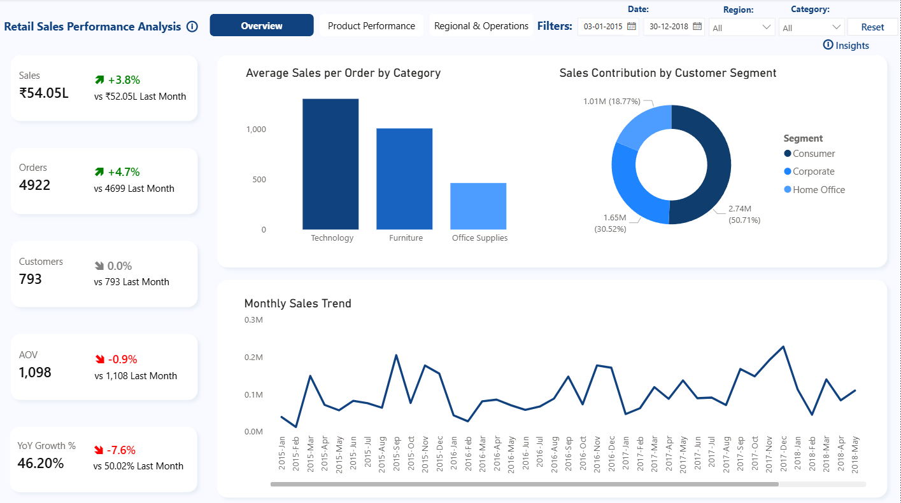
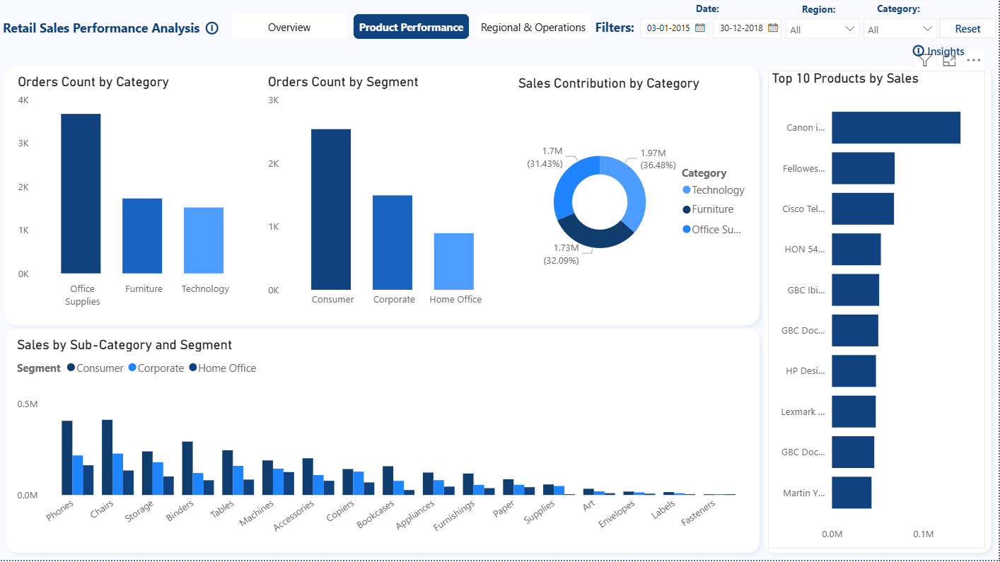
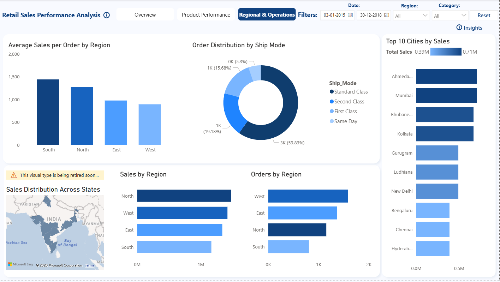

# Multi-Region Retail Sales Performance Dashboard

## Project Overview
This project analyzes retail sales performance across multiple regions using Power BI. The dashboard provides insights into sales trends, product performance, customer segments, and geographic distribution to support data-driven decision making.

## Tools & Technologies
- Power BI
- Power Query
- DAX
- Data Visualization

## Business Objective
To analyze retail sales data and identify trends across products, customers, and regions, enabling better understanding of sales performance and operational patterns.

## Dashboard Pages

### 1. Executive Overview
Provides a high-level view of overall sales performance including:
- Total Sales
- Total Orders
- Total Customers
- Average Order Value
- Monthly Sales Trend
- Customer Segment Contribution

### 2. Product Performance
Analyzes product and category level insights including:
- Orders by Category
- Orders by Customer Segment
- Sales Contribution by Category
- Top 10 Products by Sales
- Sales by Sub-Category and Segment

### 3. Regional & Operations Analysis
Provides geographic and operational insights including:
- Sales by Region
- Orders by Region
- Sales Distribution Across States
- Top Cities by Sales
- Order Distribution by Shipping Mode
- Average Sales per Order by Region

## Key Insights
- Consumer segment contributes the largest share of total sales, indicating strong demand from individual customers compared to corporate buyers.
- Technology category generates the highest average sales per order, suggesting higher-value transactions compared to other product categories.
- Sales are highly concentrated in major metropolitan cities such as Ahmedabad, Mumbai, and Kolkata, highlighting urban demand dominance.
- Order volume is highest in the Office Supplies category, indicating frequent but lower-value transactions compared to other categories.
- Regional analysis shows relatively balanced sales distribution across regions, with slight variations in average order value.
- Standard shipping mode accounts for the majority of orders, indicating preference for cost-effective delivery options.

## Dashboard Preview

### Executive Overview

### Product Performance

### Regional & Operations Analysis

